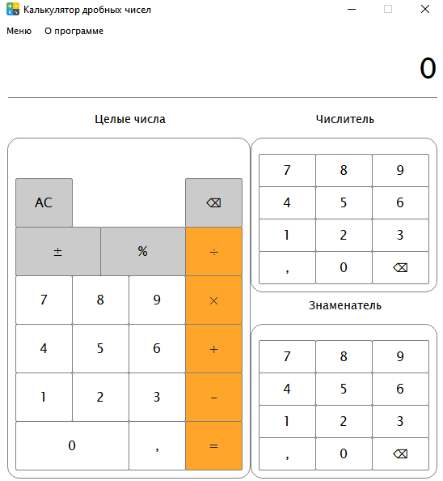
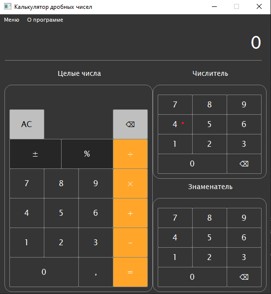

# Course-project-on-OOP

ОПИСАНИЕ ПРОЕКТА
========================
В чем заключается суть создания?
-------------------------
* Для практики. Изучение новой IDE для работы с формами + кроссплатформенность.
* Для учебы. Требуется выполнить курсовой проект на тему "Калькулятор обычных дробей".
* Для всех. Открытый исходных код, который может кому-то понадобится для создания подобных проектов.
> Когда я говорю, что исходных код открыт - не значит что нужно его полностью копировать, как я :clown:.

Скриншот интерфейса программы.
-------------------------

<<<<<<< HEAD

=======

>>>>>>> a9a841016031b9b71fb33350e222262a107b2eee
